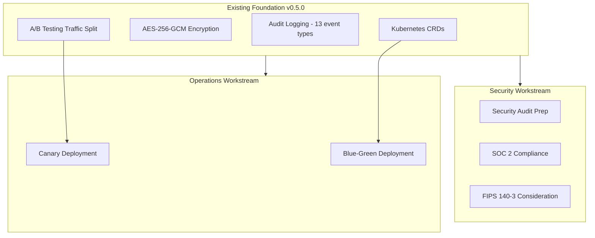
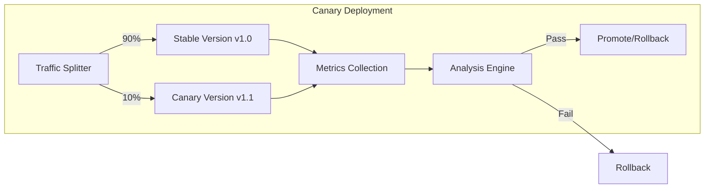
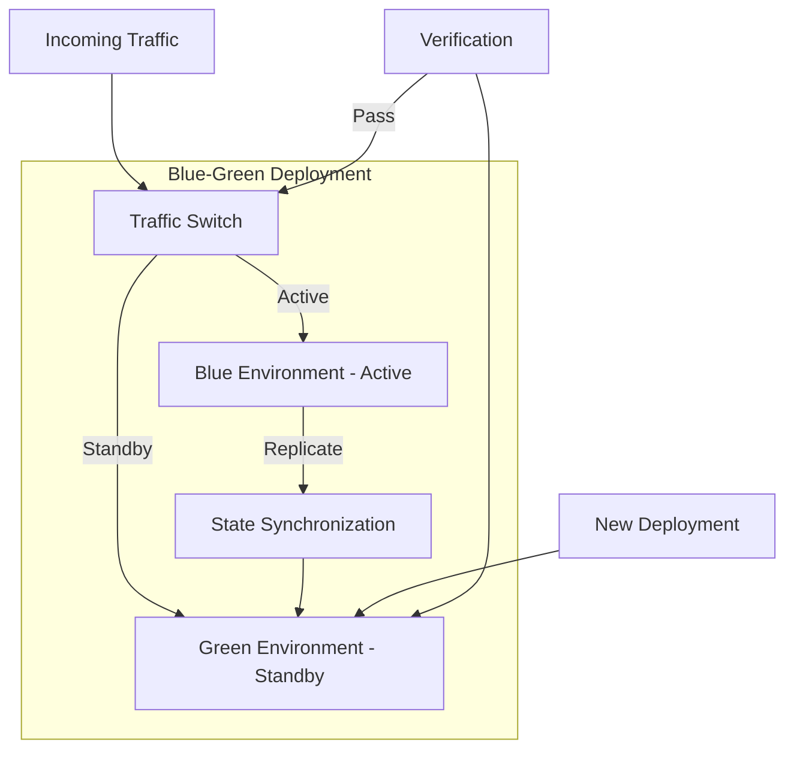
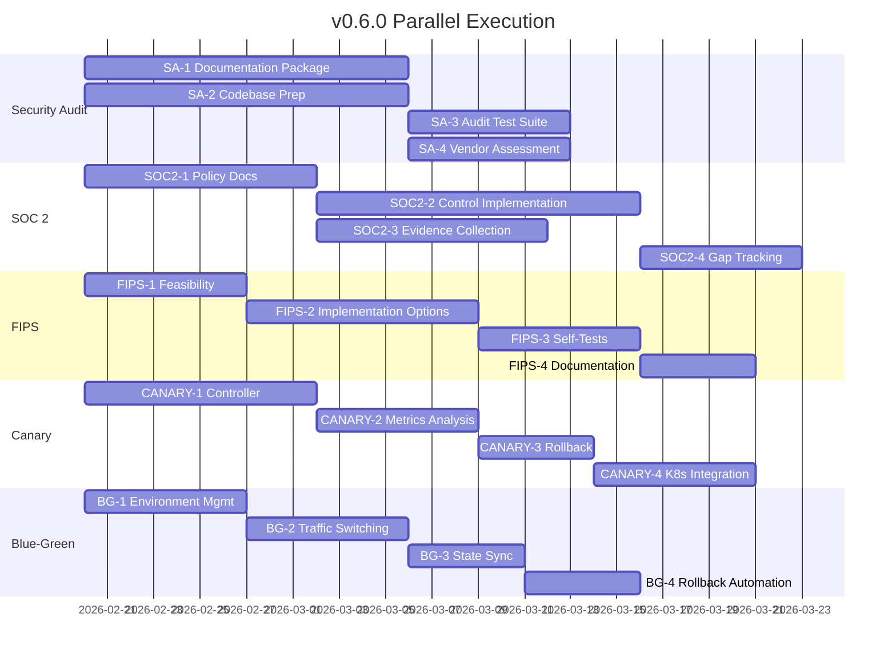

# Veritas SPARK v0.6.0 Execution Plan

**Version:** 0.6.0  
**Created:** 2026-02-18  
**Status:** Planning  
**Previous Version:** 0.5.0 (Complete)

---

## Executive Summary

v0.6.0 focuses on enterprise readiness through security audit preparation, compliance frameworks, and advanced deployment automation. All five workstreams can execute in parallel with minimal dependencies.

---

## Parallel Workstreams Overview

---

## Workstream 1: Internal Security Audit

**Goal:** Conduct comprehensive internal security audit to identify vulnerabilities, document security posture, and prepare for future third-party validation when financially viable.

### Current Security Posture

| Component           | Status              | Evidence                                                               |
| ------------------- | ------------------- | ---------------------------------------------------------------------- |
| Prompt Injection    | 55+ patterns        | [`prompt_injection.rs`](core-runtime/src/security/prompt_injection.rs) |
| PII Detection       | 13 types            | [`pii_detector.rs`](core-runtime/src/security/pii_detector.rs)         |
| Output Sanitization | Active filtering    | [`output_sanitizer.rs`](core-runtime/src/security/output_sanitizer.rs) |
| Model Encryption    | AES-256-GCM         | [`encryption.rs`](core-runtime/src/security/encryption.rs)             |
| Audit Logging       | 13 event types      | [`audit.rs`](core-runtime/src/security/audit.rs)                       |
| Sandbox Isolation   | Windows Job Objects | [`sandbox/windows.rs`](core-runtime/src/sandbox/windows.rs)            |

### Tasks

- [ ] **SA-1:** Create security documentation package
  - Threat model documentation update
  - Security architecture diagrams
  - Cryptographic implementation details
  - Input validation boundary analysis
- [ ] **SA-2:** Codebase security review
  - Document all unsafe blocks with safety invariants
  - Create security-relevant code annotations
  - Generate call graphs for security-critical paths
  - Document all external dependency security review

- [ ] **SA-3:** Internal security test suite
  - Security boundary tests
  - Cryptographic correctness tests
  - Input fuzzing harnesses
  - Penetration test scenarios

- [ ] **SA-4:** Self-assessment and findings tracking
  - Internal vulnerability assessment
  - Findings documentation and severity classification
  - Remediation tracking process
  - Security posture baseline report

### Deliverables

1. `docs/security/INTERNAL_AUDIT_REPORT.md` - Complete internal audit findings
2. `tests/security_audit/` - Security audit test suite
3. `docs/security/SECURITY_POSTURE_BASELINE.md` - Baseline security assessment
4. Findings tracker with remediation status

---

## Workstream 2: SOC 2 Compliance Preparation

**Goal:** Establish controls and documentation for SOC 2 Type I readiness.

### SOC 2 Trust Service Criteria Mapping

| Criteria                      | Current State              | Gap                        |
| ----------------------------- | -------------------------- | -------------------------- |
| CC6.1 - Logical Access        | Auth tokens, rate limiting | MFA not implemented        |
| CC6.2 - System Accounts       | Machine ID binding         | Service account management |
| CC6.3 - Access Removal        | Session timeouts           | Automated deprovisioning   |
| CC6.6 - Transmission Security | IPC only, no network       | N/A - air-gapped           |
| CC6.7 - Data Protection       | AES-256-GCM encryption     | Key rotation policy        |
| CC7.1 - Vulnerability Mgmt    | 430+ security tests        | Formal remediation SLA     |
| CC7.2 - Anomaly Detection     | Audit logging              | SIEM integration           |
| CC8.1 - Change Management     | Version control            | CAB process                |

### Tasks

- [ ] **SOC2-1:** Policy documentation
  - Information security policy
  - Access control policy
  - Change management policy
  - Incident response policy

- [ ] **SOC2-2:** Control implementation
  - Key rotation mechanism for model encryption
  - Session management enhancements
  - Access logging improvements

- [ ] **SOC2-3:** Evidence collection
  - Access review templates
  - Change log formats
  - Incident tracking system

- [ ] **SOC2-4:** Gap remediation tracking
  - Control gap register
  - Remediation timeline
  - Testing procedures

### Deliverables

1. `docs/compliance/SOC2_POLICIES.md` - Policy documentation
2. `docs/compliance/SOC2_CONTROLS.md` - Control mapping
3. Key rotation implementation in encryption module

---

## Workstream 3: FIPS 140-3 Consideration

**Goal:** Assess feasibility and requirements for FIPS 140-3 cryptographic module validation.

### Current Cryptographic Implementation

| Component        | Algorithm     | FIPS Status |
| ---------------- | ------------- | ----------- |
| Model Encryption | AES-256-GCM   | Approved    |
| Key Derivation   | PBKDF2-SHA256 | Approved    |
| Random Nonce     | OsRng (CSRNG) | Approved    |
| Session Tokens   | SHA-256       | Approved    |

### FIPS 140-3 Requirements Analysis

| Requirement           | Current                  | Gap                     |
| --------------------- | ------------------------ | ----------------------- |
| Approved Algorithms   | AES-GCM, PBKDF2, SHA-256 | None                    |
| FIPS-Validated Module | Rust `aes-gcm` crate     | Not validated           |
| Key Management        | In-memory, derived       | Hardware HSM option     |
| Self-Tests            | Algorithm tests          | Not implemented         |
| Physical Security     | Software only            | N/A for software module |

### Tasks

- [ ] **FIPS-1:** Feasibility assessment
  - Rust cryptographic ecosystem FIPS status
  - BoringSSL/bcrypt integration options
  - Cost-benefit analysis

- [ ] **FIPS-2:** Implementation options
  - Option A: Use validated Rust crypto (if available)
  - Option B: FFI to validated library (BoringSSL, Windows CNG)
  - Option C: Hardware security module integration

- [ ] **FIPS-3:** Self-test implementation
  - Known-answer tests for AES-GCM
  - PBKDF2 verification tests
  - Conditional self-tests

- [ ] **FIPS-4:** Documentation
  - Cryptographic module boundary
  - Security policy document draft
  - Validation cost estimate

### Deliverables

1. `docs/security/FIPS_ASSESSMENT.md` - Feasibility report
2. Self-test implementation in encryption module
3. FIPS transition plan (if proceeding)

---

## Workstream 4: Canary Deployment Automation

**Goal:** Implement automated canary deployment with traffic shifting and rollback.

### Existing Foundation

- [`ab_testing/traffic/`](core-runtime/src/ab_testing/traffic/) - Traffic splitting infrastructure
- [`k8s/types.rs`](core-runtime/src/k8s/types.rs) - VeritasModel CRD with variant support
- [`models/version.rs`](core-runtime/src/models/version.rs) - Version history for rollback

### Architecture

### Tasks

- [ ] **CANARY-1:** Canary controller implementation
  - Deployment state machine
  - Traffic weight management
  - Health check integration

- [ ] **CANARY-2:** Metrics analysis
  - Error rate comparison
  - Latency percentile analysis
  - Custom metric thresholds

- [ ] **CANARY-3:** Automated rollback
  - Threshold breach detection
  - Automatic traffic shift
  - Alert generation

- [ ] **CANARY-4:** Kubernetes integration
  - Canary CRD definition
  - Controller implementation
  - Helm chart updates

### Deliverables

1. `src/deployment/canary.rs` - Canary controller
2. `k8s/crds/canary.yaml` - Canary CRD
3. Updated Helm chart with canary support

---

## Workstream 5: Blue-Green Deployment Support

**Goal:** Implement blue-green deployment with instant traffic switching.

### Architecture

### Tasks

- [ ] **BG-1:** Environment management
  - Blue/green environment CRDs
  - Environment health tracking
  - Resource allocation

- [ ] **BG-2:** Traffic switching
  - Atomic switch mechanism
  - DNS/service update automation
  - Switch verification

- [ ] **BG-3:** State synchronization
  - Model cache warming
  - Session state handling
  - KV-cache pre-population

- [ ] **BG-4:** Rollback automation
  - Instant rollback trigger
  - Failed deployment detection
  - Automatic environment swap

### Deliverables

1. `src/deployment/blue_green.rs` - Blue-green controller
2. `k8s/crds/environment.yaml` - Environment CRD
3. Deployment runbook documentation

---

## Parallel Execution Timeline

---

## Dependencies Between Workstreams

| From                  | To                      | Dependency Type          |
| --------------------- | ----------------------- | ------------------------ |
| SOC2-2 (Key Rotation) | FIPS-3 (Self-Tests)     | Code shared              |
| CANARY-4 (K8s CRDs)   | BG-1 (Environment CRDs) | Pattern shared           |
| SA-2 (Codebase Prep)  | All                     | Documentation foundation |

**Note:** All workstreams can start immediately. Dependencies are minor and do not block parallel execution.

---

## Success Criteria

### Internal Security Audit

- [ ] Complete internal audit report documented
- [ ] All security tests passing
- [ ] Findings classified and remediation planned
- [ ] Security posture baseline established

### SOC 2

- [ ] All policies documented
- [ ] Control gaps identified with remediation plan
- [ ] Key rotation implemented

### FIPS 140-3

- [ ] Feasibility decision made
- [ ] Self-tests implemented
- [ ] Cost estimate documented

### Canary Deployment

- [ ] Controller operational
- [ ] Automated rollback tested
- [ ] K8s integration complete

### Blue-Green Deployment

- [ ] Environment switching operational
- [ ] State sync working
- [ ] Rollback tested

---

## Resource Requirements

| Workstream     | Primary Skills          | Effort |
| -------------- | ----------------------- | ------ |
| Security Audit | Security, Documentation | High   |
| SOC 2          | Compliance, Policy      | Medium |
| FIPS           | Cryptography, FFI       | Medium |
| Canary         | K8s, Rust               | Medium |
| Blue-Green     | K8s, Rust               | Medium |

---

## Risk Assessment

| Risk                             | Probability | Impact | Mitigation                |
| -------------------------------- | ----------- | ------ | ------------------------- |
| FIPS validation cost prohibitive | Medium      | Low    | Assess before committing  |
| Security audit findings          | High        | Medium | Pre-audit self-assessment |
| K8s API changes                  | Low         | Medium | Pin K8s version           |
| SOC 2 scope creep                | Medium      | Medium | Define clear boundaries   |

---

## Next Steps

1. **Immediate:** Begin all five workstreams in parallel
2. **Week 1:** Complete FIPS feasibility assessment (decision point)
3. **Week 2:** Complete security audit documentation package
4. **Week 3:** Complete canary controller implementation
5. **Week 4:** Complete blue-green environment management

---

## Appendix: Existing Security Test Coverage

| Category            | Tests   | Status      |
| ------------------- | ------- | ----------- |
| Prompt Injection    | 12      | Passing     |
| PII Detection       | 8       | Passing     |
| Output Sanitization | 6       | Passing     |
| Encryption          | 30      | Passing     |
| Audit Logging       | 10      | Passing     |
| Sandbox             | 5       | Passing     |
| **Total**           | **71+** | **Passing** |

See [`ROADMAP.md`](../ROADMAP.md) for complete test status.
